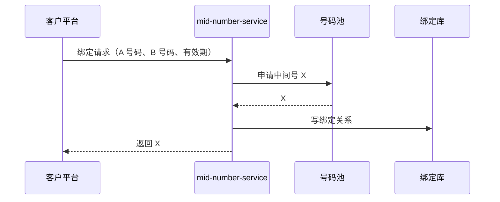

# 中间号核心业务流程

> 填写指引：每个流程一张时序图 + 一个步骤表。步骤表的“代码位置”一列由研发填写，指向具体类/方法。

## 1. 绑定

| 步骤 | 说明 | 代码位置 | 失败处理 |
| --- | --- | --- | --- |
| 1 | 参数校验 | TODO | 返回错误码（见 `06-data/api/`） |
| 2 | 申请中间号 | TODO | TODO |
| 3 | 写绑定关系 | TODO | TODO |

## 2. 呼叫接续

TODO：来电 → 查绑定 → 路由到真实号码 → 话单。见 `call-routing/overview.md`。

## 3. 解绑 / 到期回收

TODO

## 4. 话单与计费

TODO：见 `charging/overview.md`。
