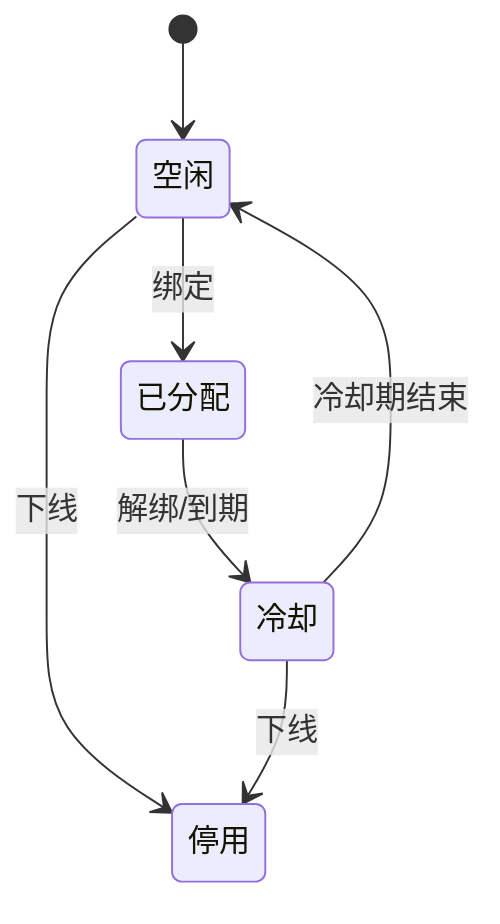

# 号码池

## 1. 号码状态机

> 以上为通用示意，按实际状态和代码中的枚举值修正，并在下表写明代码中的枚举名。

| 状态 | 代码枚举 | 说明 |
| --- | --- | --- |
| 空闲 | TODO | |
| 已分配 | TODO | |
| 冷却 | TODO | 冷却时长：TODO |
| 停用 | TODO | |

## 2. 分配策略

TODO：按地域 / 客户 / 号段分配的规则，并发分配如何避免同号重复分配。

## 3. 约束与坑

- TODO
