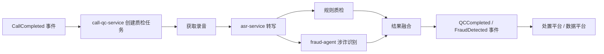

# 离线质检流水线

> 以上为待核实的示意，节点名须与 `knowledge.yaml` 的服务名和 `06-data/events/events.yaml` 的事件名一致。

## 步骤表

| # | 步骤 | 服务 | 输入 | 输出 | 超时 / 重试 | 失败后果 |
| --- | --- | --- | --- | --- | --- | --- |
| 1 | 创建任务 | call-qc-service | CallCompleted | qc_task 记录 | TODO | |
| 2 | 获取录音 | call-qc-service | 录音地址 | 音频文件 | TODO | TODO：录音未落盘时的重试策略 |
| 3 | 转写 | asr-service | 音频 | 转写文本 | TODO | |
| 4 | 规则质检 | call-qc-service | 转写文本 | 命中规则 | TODO | |
| 5 | 涉诈识别 | fraud-agent | 转写文本 | 风险判定 | TODO | |
| 6 | 融合与输出 | call-qc-service | 4、5 结果 | 事件 | TODO | |

## 任务状态

| 状态 | 代码枚举 | 说明 |
| --- | --- | --- |
| TODO | | |

详细调用链见 `05-code/call-chain/qc-offline.md`。
