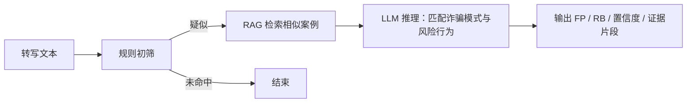

# 质检 / 反诈 Agent

## 1. 工作流

## 2. 工具与输出

| 项 | 说明 |
| --- | --- |
| 可用工具 | TODO |
| 输出结构 | TODO：包含 pattern_id、behaviors、confidence、evidence |
| 失败兜底 | TODO：超时 / 解析失败时的默认结论 |

## 3. 评测

TODO：评测集位置、指标（准确率、召回率、误报率）、上线门槛。
