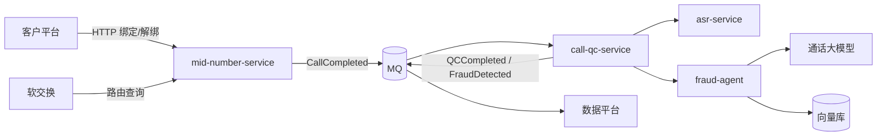

# 总体架构

> 节点名必须与 `knowledge.yaml` 的 `services` 一致，`kb_lint.py` 会检查。
> 真实依赖以 `05-code/dependency-map.yaml`（由代码生成）为准；本图表达的是**设计意图**。

## 分层

| 层 | 组件 | 说明 |
| --- | --- | --- |
| 接入层 | TODO：网关、软交换接口 | |
| 业务层 | mid-number-service、call-qc-service | |
| AI 层 | asr-service、fraud-agent、模型服务 | |
| 中间件 | MQ、缓存、对象存储 | 见 `middleware.md` |
| 数据层 | 业务库、数据平台 | 见 `storage.md` |

## 关键架构原则

- TODO：例如“质检链路异常不得影响呼叫接续”
- TODO：例如“服务间异步通信优先走 MQ，同步调用只用于在线查询”
