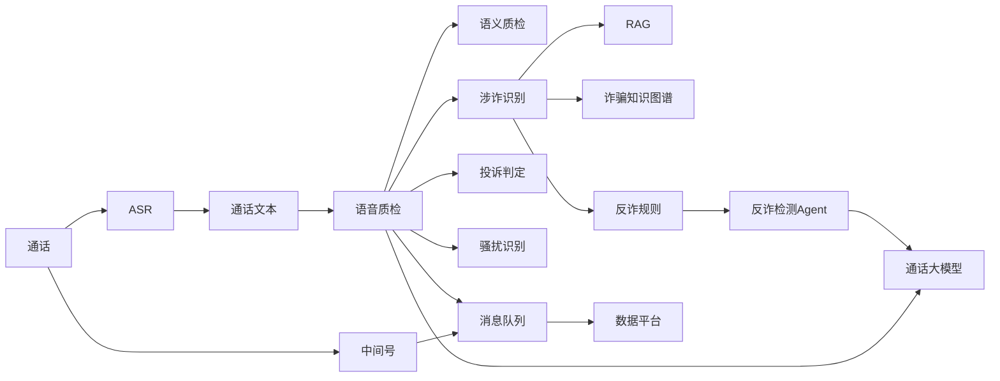
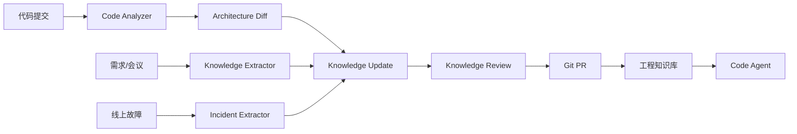
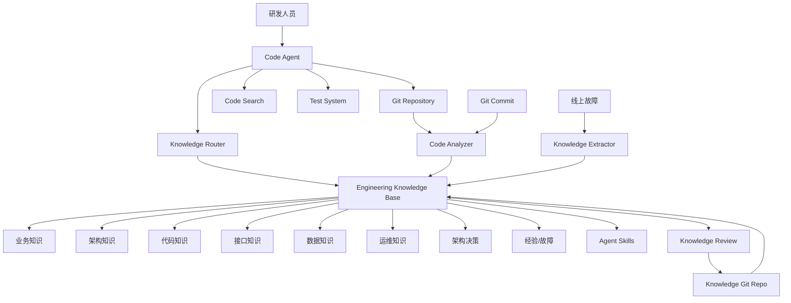

如果目标是让 **Code Agent（Claude Code / Codex / Gemini CLI / Qwen Code / Trae / OpenCode 等）长期理解并维护“中间号 + 语音质检”整套系统**，我不建议简单做一个 `README.md` 或把所有资料丢进向量库。

更适合你的方式是建设一套 **“Agent Engineering Knowledge Base（工程知识库）”**：把业务知识、架构知识、代码知识、接口知识、运行知识、规则知识、决策记录和研发规范组织成一个**可被 Agent 按需加载、持续演进的工程知识系统**。

我会建议采用：

> **Markdown 知识库 + 代码索引 + 架构图 + ADR + YAML/JSON结构化元数据 + Agent Skills + 自动知识同步**

整体可以设计成下面这样：

```mermaid
flowchart TB
    A[中间号 + 语音质检知识库] --> B[业务知识]
    A --> C[系统架构]
    A --> D[代码知识]
    A --> E[接口/数据]
    A --> F[运行运维]
    A --> G[算法/模型]
    A --> H[研发规范]
    A --> I[历史决策]

    B --> B1[中间号业务]
    B --> B2[700号码]
    B --> B3[出海]
    B --> B4[通话业务]

    C --> C1[总体架构]
    C --> C2[中间号平台]
    C --> C3[质检平台]
    C --> C4[AI/大模型平台]

    D --> D1[Repository Map]
    D --> D2[模块]
    D --> D3[核心类/接口]
    D --> D4[调用链]

    E --> E1[API]
    E --> E2[MQ]
    E --> E3[DB]
    E --> E4[事件]

    F --> F1[部署]
    F --> F2[监控]
    F --> F3[故障]
    F --> F4[应急]

    G --> G1[ASR]
    G --> G2[质检模型]
    G --> G3[反诈]
    G --> G4[RAG]
    G --> G5[Agent]

    H --> H1[编码规范]
    H --> H2[测试规范]
    H --> H3[发布规范]

    I --> I1[ADR]
    I --> I2[历史方案]
    I --> I3[踩坑记录]
```



---

# 一、首先不要把它理解成“文档库”

真正需要建设的是：

> **Code Agent 的系统认知层**

也就是让 Agent 在接到任务：

> “修改语音质检中的涉诈识别规则”

时，不只是知道某个 Java/Python 文件在哪里，而是能够自动建立：

```text
业务需求
 ↓
质检业务流程
 ↓
涉诈识别
 ↓
规则体系
 ↓
规则引擎
 ↓
Agent
 ↓
相关服务
 ↓
API
 ↓
MQ
 ↓
数据库
 ↓
测试
 ↓
部署
```

因此知识库应该同时描述：

**What：是什么**

**Why：为什么这么设计**

**Where：代码在哪里**

**How：怎么运行**

**Constraint：有什么限制**

**History：为什么不能随便改**

---

# 二、推荐的知识库目录

我比较建议你直接建立一个独立 Git Repo：

```text
cmic-engineering-kb/
│
├── AGENTS.md
├── README.md
├── INDEX.md
│
├── 00-context/
│   ├── company.md
│   ├── business-overview.md
│   └── glossary.md
│
├── 01-mid-number/
│   ├── overview.md
│   ├── business-flow.md
│   ├── 700/
│   │   ├── overview.md
│   │   ├── architecture.md
│   │   ├── business-flow.md
│   │   └── interfaces.md
│   ├── overseas/
│   ├── call-routing/
│   ├── number-pool/
│   └── charging/
│
├── 02-call-qc/
│   ├── overview.md
│   ├── architecture.md
│   ├── pipeline.md
│   ├── realtime-qc.md
│   ├── semantic-qc.md
│   ├── fraud-detection.md
│   ├── complaint-detection.md
│   ├── harassment-detection.md
│   └── risk-classification.md
│
├── 03-ai/
│   ├── overview.md
│   ├── llm.md
│   ├── rag.md
│   ├── agent.md
│   ├── asr.md
│   ├── tts.md
│   └── model-serving.md
│
├── 04-architecture/
│   ├── overall.md
│   ├── network.md
│   ├── middleware.md
│   ├── storage.md
│   ├── high-availability.md
│   └── security.md
│
├── 05-code/
│   ├── repositories.yaml
│   ├── services/
│   ├── modules/
│   ├── dependency-map.yaml
│   ├── api-map.yaml
│   └── call-chain/
│
├── 06-data/
│   ├── databases/
│   ├── tables/
│   ├── mq/
│   ├── events/
│   └── data-dictionary/
│
├── 07-operation/
│   ├── deployment.md
│   ├── monitoring.md
│   ├── alerting.md
│   ├── troubleshooting/
│   └── emergency/
│
├── 08-development/
│   ├── coding.md
│   ├── testing.md
│   ├── api-development.md
│   ├── database-change.md
│   └── release.md
│
├── 09-decisions/
│   ├── ADR-001.md
│   ├── ADR-002.md
│   └── ...
│
├── 10-lessons/
│   ├── incidents/
│   ├── bugs/
│   ├── performance/
│   └── pitfalls/
│
└── 99-agent/
    ├── skills/
    ├── workflows/
    ├── prompts/
    └── retrieval-rules/
```

这个结构有一个非常重要的特点：

**业务知识和代码知识分开。**

这样 Agent 才不会变成一个“代码搜索机器人”。

---

# 三、最重要的是 `AGENTS.md`

这个文件相当于：

> **整个系统给 Code Agent 的“系统宪法”**

例如：

```markdown
# 中间号与语音质检工程知识库

## 1. 系统范围

本知识库覆盖：

- 中间号业务
- 700号码
- 中间号出海
- 通话业务
- 语音质检
- 通话大模型
- 反诈
- RAG
- AI Agent
- 实时质检

## 2. Agent 工作原则

修改代码前必须：

1. 阅读对应业务知识
2. 阅读系统架构
3. 定位代码模块
4. 分析调用链
5. 检查接口影响
6. 检查数据库影响
7. 检查 MQ/Event 影响
8. 检查测试
9. 检查部署影响

## 3. 修改原则

禁止：

- 未理解业务直接重构
- 修改公共接口而不检查调用方
- 修改数据库字段而不检查消费者
- 修改 MQ 消息结构而不检查上下游
- 修改质检规则而不更新规则文档

## 4. 优先级

代码事实 > 架构文档 > 设计文档 > 会议纪要 > Agent 推测

如果知识库与代码冲突：

必须标记：

CONFLICT

不得自行选择。

## 5. 不确定性

Agent 不确定时：

- 搜索知识库
- 搜索代码
- 搜索 Git 历史
- 搜索 ADR
- 最后再询问用户
```

这比单纯的 `README` 有用得多。

---

# 四、知识必须分成三种

这是整个系统最关键的设计之一。

## ① Stable Knowledge

长期稳定知识。

例如：

```text
中间号是什么
700业务是什么
质检是什么
系统总体架构
服务之间关系
核心数据库
MQ体系
```

放：

```text
01-mid-number/
02-call-qc/
04-architecture/
```

---

## ② Dynamic Knowledge

经常变化。

例如：

```text
当前部署
当前模型版本
当前接口
当前数据库
当前服务地址
当前规则
当前流量
```

建议结构化：

```yaml
service:
  name: call-qc-service
  language: java
  repository: xxx
  owner: xxx

runtime:
  cluster: xxx
  namespace: xxx

dependencies:
  - asr-service
  - mq
  - rule-engine
```

Agent 读取 YAML 比读取一篇 5000 字文章可靠得多。

---

## ③ Historical Knowledge

非常重要，但经常被忽略。

例如：

> 为什么当年没有采用 Kafka，而采用 MQ？

> 为什么 NFS 要解耦？

> 为什么这个接口不能直接删除？

> 为什么这里存在一个奇怪的 retry？

这些不要删。

放到：

```text
09-decisions/
10-lessons/
```

---

# 五、用 ADR 保存“为什么”

例如：

```text
09-decisions/
    ADR-001-mq-migration.md
    ADR-002-nfs-decoupling.md
    ADR-003-700-architecture.md
    ADR-004-realtime-qc.md
```

模板：

```markdown
# ADR-004 实时质检采用分片流式处理

## Status

Accepted

## Context

当前语音质检主要采用离线处理。

随着实时通话业务发展，需要降低质检延迟。

## Decision

采用：

通话流
↓
音频分片
↓
ASR
↓
实时文本
↓
质检Agent
↓
风险事件

## Why

主要考虑：

1. 降低端到端延迟
2. 支持准实时风险发现
3. 支持后续实时反诈

## Alternatives

方案A：完整通话结束后质检

方案B：固定时间窗口

方案C：音频分片流式处理

最终选择 C。

## Consequences

优点：

- 延迟降低
- 可以提前发现风险

代价：

- 状态管理复杂
- 上下文拼接复杂
- ASR错误影响增加
```

以后 Agent 才知道：

> **这个设计不是“看起来这样”，而是历史上经过选择的。**

---

# 六、代码知识不要手写，应该自动生成

这一点尤其适合你的场景。

比如你有：

```text
mid-number-service
call-service
qc-service
fraud-agent
rag-service
asr-service
```

不要人工维护：

```text
qc-service调用fraud-agent
```

而是自动从代码生成：

```yaml
service: qc-service

dependencies:
  - fraud-agent
  - asr-service
  - mysql
  - mq

apis:
  - POST /qc/task
  - GET /qc/result

events:
  consume:
    - CallCompleted
    - ASRCompleted

  produce:
    - QCCompleted
    - FraudDetected
```

形成：

> **Repository → AST → Dependency Graph → Knowledge Graph**

---

# 七、最终最好形成一张“工程知识图谱”

比如：



以后 Agent 查询：

> “修改反诈规则会影响哪些系统？”

就可以沿着：

```text
Rule
 ↓
Fraud Agent
 ↓
QC
 ↓
MQ
 ↓
Data
```

进行影响分析。

---

# 八、你的“反诈知识库”还可以单独设计

结合你之前规划的：

> 诈骗模式 + 风险行为 + 话术链路

我建议：

```text
02-call-qc/
└── fraud/
    ├── overview.md
    ├── fraud-patterns.yaml
    ├── risk-behaviors.yaml
    ├── conversation-flows.yaml
    ├── rules.yaml
    ├── cases/
    ├── knowledge-graph/
    └── agents/
```

例如：

```yaml
pattern:
  id: FP-INVESTMENT-001
  name: 虚假投资理财

risk_behaviors:
  - RB-001
  - RB-002
  - RB-003

conversation_flow:
  - step: 1
    behavior: 建立信任

  - step: 2
    behavior: 推荐投资

  - step: 3
    behavior: 引导下载APP

  - step: 4
    behavior: 要求转账

rules:
  - RULE-001
  - RULE-002
```

这就开始从：

> **文档知识库**

升级成：

> **Machine-readable Knowledge Base**

---

# 九、再给 Code Agent 建 Skills

这是我认为你这个项目最值得做的一层。

例如：

```text
99-agent/skills/

├── understand-system/
├── impact-analysis/
├── modify-api/
├── modify-database/
├── modify-mq/
├── add-qc-rule/
├── add-fraud-pattern/
├── troubleshoot/
├── write-test/
├── architecture-review/
└── release-check/
```

例如：

```text
add-qc-rule/
    SKILL.md
    workflow.md
    checklist.md
    examples/
```

`SKILL.md`：

```markdown
# Add QC Rule

## Purpose

新增语音质检规则。

## Preconditions

必须确认：

- 质检类型
- 输入数据
- 规则来源
- 输出结果
- 风险等级

## Workflow

1. 阅读 qc/overview.md
2. 阅读 qc/rules.md
3. 查找规则引擎代码
4. 查找规则配置
5. 分析现有规则
6. 增加规则
7. 增加测试
8. 验证规则冲突
9. 更新知识库

## Validation

必须检查：

- false positive
- false negative
- rule conflict
- performance
- backward compatibility
```

这样以后你说：

> “增加一个投诉判定规则”

Agent 不需要你告诉它怎么做。

它自己加载：

```text
add-qc-rule
```

---

# 十、我尤其建议加入“任务 → 知识召回”机制

不要让 Agent 每次都把整个知识库读一遍。

应该：

```text
User Task
   ↓
Task Classifier
   ↓
Knowledge Router
   ↓
Relevant Knowledge
   ↓
Code Search
   ↓
Agent
```

例如用户说：

> 修改700号码的号码申请接口

自动加载：

```text
01-mid-number/700/
04-architecture/
05-code/services/number-application/
06-data/
08-development/api-development.md
```

而不是加载整个知识库。

---

# 十一、可以设计一个 `knowledge.yaml`

作为知识库总索引：

```yaml
domains:

  mid_number:
    description: 中间号业务
    knowledge:
      - 01-mid-number/
    code:
      - mid-number-service
    skills:
      - understand-mid-number
      - modify-mid-number-api

  call_qc:
    description: 通话语音质检
    knowledge:
      - 02-call-qc/
    code:
      - call-qc-service
      - fraud-agent
    skills:
      - add-qc-rule
      - troubleshoot-qc

  ai:
    description: 通话AI能力
    knowledge:
      - 03-ai/
    code:
      - llm-service
      - asr-service
      - rag-service
```

Agent 首先读这个。

它就知道：

> “我要去哪里找答案。”

---

# 十二、再往前一步：知识库自动演进

这个非常适合你之前研究的：

> Agent + Feedback Loop + Self Modification

可以设计成：



也就是说：

**知识库本身也是一个软件工程项目。**

所有知识更新：

```text
Agent生成
   ↓
PR
   ↓
人工Review
   ↓
Merge
```

而不是 Agent 随便修改。

---

# 十三、甚至可以做“知识库 CI”

例如：

```text
knowledge lint
```

自动检查：

```text
❌ API文档不存在对应代码
❌ service依赖关系过期
❌ ADR引用不存在
❌ Mermaid架构图节点不存在
❌ YAML格式错误
❌ 服务名称不一致
❌ 数据库字段不存在
```

最终：

```text
代码 CI
+
知识 CI
```

形成：

> **Engineering Knowledge as Code**

---

# 十四、最终整体架构，我建议做成这一层



---

# 十五、如果是你这个“中间号 + 语音质检”项目，我建议分三期

### Phase 1：先把“知识资产”整理出来

不要急着搞向量数据库。

先完成：

```text
业务
架构
代码
接口
数据库
MQ
部署
故障
ADR
研发规范
```

全部 Markdown/YAML 化。

---

### Phase 2：让 Agent 真正用起来

重点建设：

```text
AGENTS.md
+
knowledge.yaml
+
Skills
+
Code Search
+
Dependency Graph
```

做到：

> **一个 Agent 新接手项目，30分钟内可以建立系统认知。**

---

### Phase 3：知识自动演进

最终变成：

```text
代码
 ↓
自动分析
 ↓
知识图谱
 ↓
知识库
 ↓
Agent
 ↓
研发
 ↓
代码变更
 ↓
重新分析
 ↓
知识更新
```

形成闭环。

---

# 十六、我认为你最终应该追求的不是 RAG，而是这个

```text
                 ┌──────────────────┐
                 │   Code Agent     │
                 └────────┬─────────┘
                          │
                  Knowledge Router
                          │
        ┌─────────────────┼─────────────────┐
        ↓                 ↓                 ↓
   Business KB       Engineering KB     Code Graph
        │                 │                 │
   中间号/700          架构/ADR/运维       Repo/API/MQ/DB
        │                 │                 │
        └─────────────────┼─────────────────┘
                          ↓
                  Agent Skills
                          ↓
                Engineering Workflow
                          ↓
               Code/Test/Review/Deploy
```

**核心思想是：**

> **Markdown 负责让人读懂，YAML/JSON 负责让机器理解，代码索引负责让 Agent 找到事实，Knowledge Graph 负责让 Agent 理解关系，ADR 负责让 Agent 理解“为什么”，Skills 负责让 Agent 知道“怎么做”。**

对于你现在的中间号 + 语音质检体系，这套东西实际上可以进一步做成一个 **“通信业务 AI 研发知识中台”**，甚至把你之前研究的 **Cordis + Plugin + Event + Capability + Profile/Bundle + Self-Modification** 思路接进来：知识库不只是给 Agent 检索，而是成为 Agent 的 **Context / Capability / Workflow / Memory 基础设施**。

如果要真正落地，我会优先从 **“目录结构 + AGENTS.md + knowledge.yaml + 10个核心Skills + 代码自动索引”** 这五件事开始，而不是先上向量数据库。
